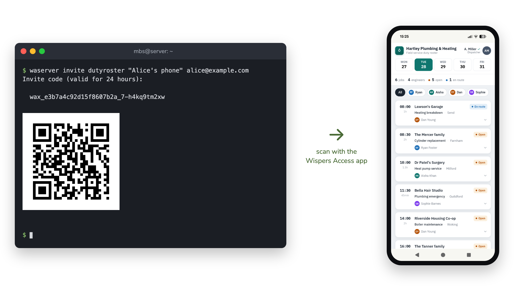

<center>
  <picture>
	<source media="(prefers-color-scheme: dark)" srcset="assets/access-logo-txt-dark.svg">
	
  </picture>
</center>

## About Wispers Access

Wispers Access makes it easy to share a web app with your coworkers, friends, or
family without having to publish it to the internet. Guests install the Wispers
Access app, scan a QR code, and then simply browse your app. No need to deal
with the complexity and security risk of exposing your app.

<p align="center">
  <picture>
	<source media="(prefers-color-scheme: dark)" srcset="assets/invite-composite-dark.png">
	
  </picture>
</p>

A perennial problem with self-hosted software is that it's hard to give people
access to it. Whether it's your company's ERP software, that vibe-coded app your
team likes, or your private photo archive at home, they're not very useful if
people can't reach them. You could put your app on the internet, but that's
increasingly hard to do securely. Anything reachable from the internet gets
probed around the clock, by scripts and by AI agents. VPNs can help, but your
phone can only be on one at a time, and your relatives may not want to set one
up.

Wispers Access solves this by automatically connecting your guests' devices
through secure peer-to-peer channels to the machines running the web apps you
want to share. Internally, the secure connections work like VPN connections, but
because they're at the application level, they never clash, not even with your
existing VPN. All your guests see is an app that magically connects them to your
web app.

No cloud service has access to your app or your traffic. The peer-to-peer
channels are built on [iroh](https://iroh.computer) or on our own [Wispers
Connect](https://connect.wispers.dev). Finding each other (and relaying when no
direct path exists) still needs rendezvous servers in the cloud, but those
servers are cryptographically unable to eavesdrop on your traffic or to inject
malicious nodes.

## Project status

Wispers Access is currently in open beta.

All clients are in open testing:
* Get Android client from the ([Play Store](https://play.google.com/store/apps/details?id=dev.wispers.access.android)).
* Get the iOS client from ([TestFlight](https://testflight.apple.com/join/AjsJChhq))
* Get the desktop app from [GitHub releases](https://github.com/s-te-ch/wispers-access/releases?q=%22Wispers+Access+desktop%22)

Instructions for setting up the server are in the quick start section below.

## Quick start

To get a first taste without installing anything on a server, grab a live invite
code at [access-demo.wispers.dev](https://access-demo.wispers.dev) and jump
straight to [step 4](#4-open-it-on-a-phone).

But you'll really want to share your _own_ app. To do this, you need `waserver`
on a machine next to the app you want to share, and a client on each guest
device.

### 1. Install waserver

On Linux or macOS:

```sh
curl -fsSL https://raw.githubusercontent.com/s-te-ch/wispers-access/main/install.sh | sh
```

This puts the newest `waserver` and `waclient` into `/usr/local/bin`. You can
also just download the binaries from the [releases
page](https://github.com/s-te-ch/wispers-access/releases). Prefer containers?
Follow the quick start in the [container README](waserver/docker/README.md)
instead. See the [hosting guide](docs/hosting.md) for more details on installing
and running waserver.

### 2. Share your app

Say the app you want to share is listening on port 3000. Then,

```sh
waserver init team "Awesome Team"
```

This creates a *share* for your team (the apps you share and the people you
share them with) and prints the path of its `share.toml`. Add the app there
(`waserver edit team` opens the file in your editor):

```toml
[[app]]
id = "myapp"
name = "My App"
upstream = ":3000"  # host:port, or :port for localhost
```

Then serve the share (`waserver start team` runs it in the background instead):

```sh
waserver serve team
```

Later edits to `share.toml` apply with `waserver reload team`. `waserver edit
team` does both in one go.

### 3. Invite a device

Invites are minted by the running server from step 2, so run this in a second
terminal (or use `waserver start team`):

```sh
waserver invite team "Alice's phone" alice@example.com --png invite.png
```

This produces the invite in three different formats: a `wax1_…` invite code to
copy-paste, an ASCII art QR code to scan with the phone, and the same QR code as
a PNG. The user ID (`alice@example.com`) is a label you choose; the shared app
sees it on every request in the `x-wispers-access-user` header, so it knows who
is connected without needing its own login.

### 4. Open it on a phone

Install Wispers Access from the
[Play Store](https://play.google.com/store/apps/details?id=dev.wispers.access.android)
(Android) or via
[TestFlight](https://testflight.apple.com/join/AjsJChhq) (iOS), tap **+**, and
scan the QR code (or copy-paste the
invite code). The shared app opens right inside Wispers Access: no VPN
profile, no open port on the internet.

### … or on a desktop

`waclient` (same releases page) serves every share you've joined on localhost:

```sh
waclient join wax1_…           # the invite code from step 3
waclient serve 8000
```

It prints a URL per app — open it in your normal browser. The first one pairs
the browser with `waclient`. From then on, the apps answer directly at
`http://<app>.<share>.wa.localhost:8000`.

## When to use something else

Wispers Access shares web apps with specific, invited people, without having to
publish those apps to the internet. Adjacent use cases may be better served by
other tools. Some examples:

- **ngrok** and friends are the fastest way to put a dev server on a public
  URL. If you _want_ the whole internet to reach your app, that's the tool.
- **Cloudflare Tunnel** publishes an app through Cloudflare's edge, with
  optional access control in front. Great for public sites and for teams already
  on Cloudflare. The trade-off is that Cloudflare terminates TLS and sees your
  traffic.
- **Tailscale** and other mesh VPNs connect whole devices into one private
  network. If you can get everyone and all their devices onto a single tailnet,
  that's a great solution. The Wispers author couldn't, got annoyed, and started
  Wispers =)

What sets Wispers Access apart is the trust model: connections are end-to-end
encrypted _and_ membership is verified peer-to-peer, so the rendezvous server
cryptographically cannot read your traffic or sneak a device into your share.
Tunnel providers and mesh-VPN coordination servers have to be trusted on one or
both of these.

## Licensing

Everything you need to run Wispers Access is open source:

- **Wispers Access** (this repo) is [MIT licensed](LICENSE), as are the
  underlying [iroh](https://github.com/n0-computer/iroh) (MIT or Apache-2.0)
  and [wispers-connect](https://github.com/s-te-ch/wispers-client) libraries.
- **The standalone hub**, [wispers-hub](https://github.com/s-te-ch/wispers-hub),
  is AGPL-3.0.

The managed Wispers Connect backend at
[connect.wispers.dev](https://connect.wispers.dev) offers a free personal tier.
